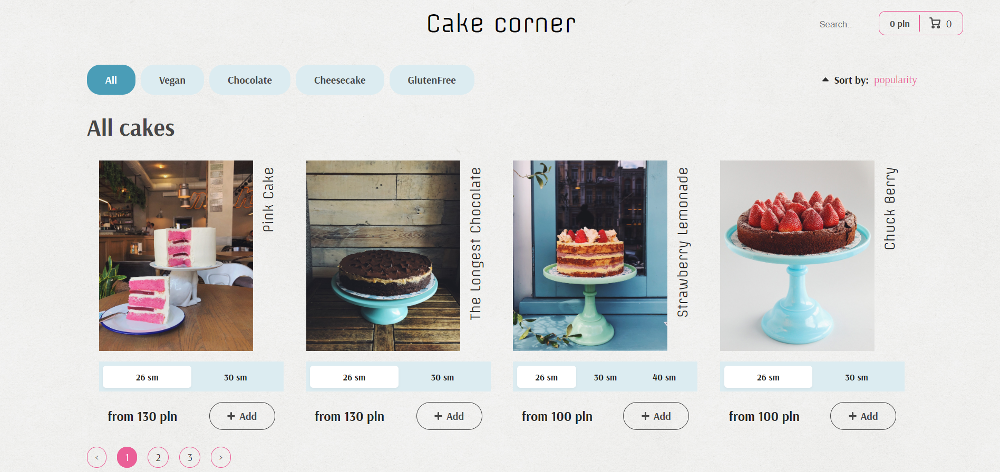
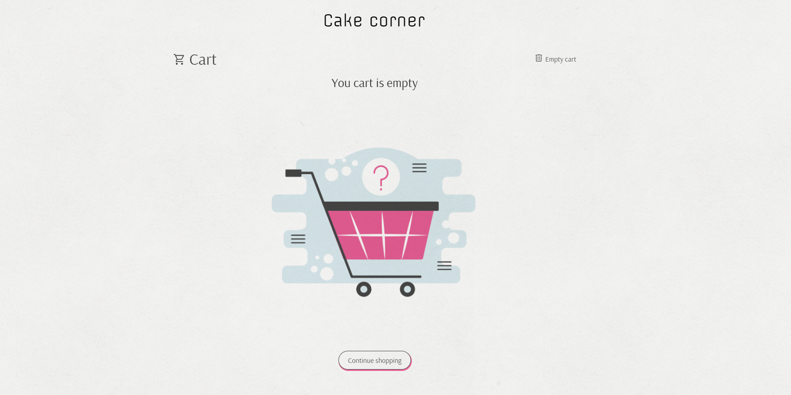
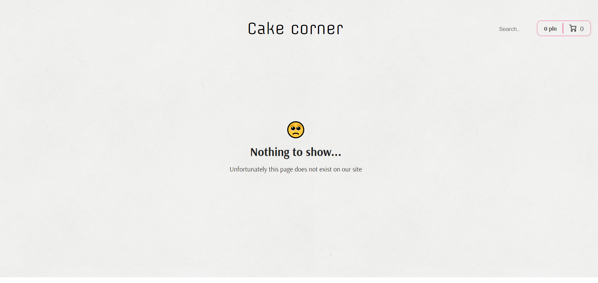

# :book: Table of Content:

- [About The Project](#project-description)
- [Goals and Scenarios](#goals)
- [Technologies](#technologies)
- [Getting Started](#getting-started)
- [Landing page](#landing-page)
- [Screenshots](#screenshots)
- [To do](#todo)
- [Demo](#demo)

## :pencil: About The Project

The aim of this project was to create a website for some bakery. The project was developed for learning purposes. By implementing bakery website I got aquinted with Typescript syntax, learn how to manipulate state using Redux Toolkit and deal with asynchronous requests and manage RESTful API. In addition I became familiar with the use of React.memo and useCallback in order to optimise rerendering. I used BEM methodology to style components and SASS as preprocessor for CSS.

## :rocket: Goals and Scenarios

The implemented website presents an imaginary bakery shop where you can choose and buy various cakes. The main functionalities are:

- searching
- filtering by categories
- sorting by price/popularity/alphabetically
- choosing different sizes
- adding to cart and managing the quantity

## :computer: Technologies

- TypeScript
- ReactJS 18, React Hooks
- React Router v6
- Axios + Fetch
- Redux
- CSS-Modules / SCSS
- React Content Loader
- React Pagination
- Lodash.Debounce
- Code Splitting

## :pushpin: Getting Started

First of all download the project. Then in the project directory use the following command to start the application:

```bash
  npm start
```

The app will be in the development mode.\
Open [http://localhost:3000](http://localhost:3000) to view it in the browser.

## Screenshots

### Landing page



### Cart


### Empty cart



### Not found page



## To do(and some bugs)

There are some issues with filtering: you can not filter items while you are not on the first page. This is connected with mockapi service, which allows to do filtering and searching, but does it wrong when you use PAGINATION at the same time.

Functionalities to be implemented:

- ordering cakes
- storing recent orders

## Demo

- Current demo version: [https://cake-corner-pink.vercel.app/](https://cake-corner-pink.vercel.app/)
